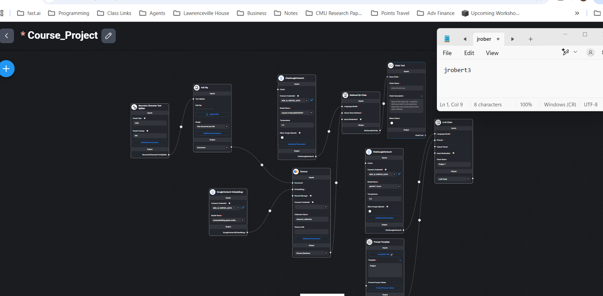
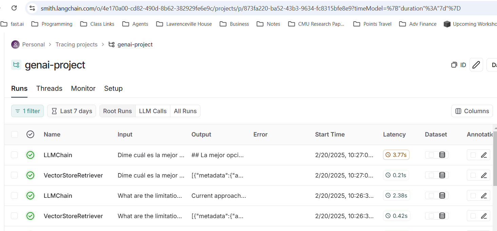

Project Authors: Nicholas Chermak and Jonathan Roberts

**Important files for Graders**
- app.py
- Dockerfile
- url_documents - our downloaded and preprocessed papers
- requirements.text

#### Flowise


#### Limitations and Assumptions
The limitations of our application are numerous but in the context of our assumptions become more reasonable.
Assuming a small research team with a maximal document need and specific questions to ask, we do not hit the normal limits of compute, autoscaled deployment, optimized application serving and latency, etc. However, in the user domain, this app is quite limited as we (1) do not enable drag and drop for instance (2) do not enable a massive context window (3) limit the system prompt template to being concise which can limit user usefulness if you really need a collection of documents compared side by side in detail as one might in preparing a lit review (4) limited default model and the inability to change models or embeddings in app (5) No in memory document upload or configurable temperature in app

So there are many, but this app does enable a significant proof of concept that would form the basis for a very useful tool to a research team.

#### LangSmith Traces


### Instructions to Deploy
1. Spin up necessary resources in cloud service provider
- Kubernetes Cluster
- Artifact/Container Repo

2. Authorize your terminal with docker login and connect to your cloud service provider

3. Be in the course-project-option-i-aitechroberts/ folder in your terminal

4. Run the following commands to build and push the application image to your Container Repo
- Keep in mind to change the repo name to your repo
```bash
docker build -t us-central1-docker.pkg.dev/systool-436201/genai-repo/genai-project:latest .
docker push us-central1-docker.pkg.dev/systool-436201/genai-repo/genai-project:latest
```

5. Go into the cloud service provider GUI in your container repo for the image you just pushed and deploy to your K8s cluster with the service created to allow access from the wider internet to your application

## Project Checklist
### App Resources Checklist
- [x] [Streamlit (20%)](####Streamlit)
- [x] [RAG (15%)](####RAG)
- [x] [LLM Integration](####Google-Dataproc)
- [x] [FlowiseAI](####Google-Cloud-Storage)
- [x] [Cloud Deployment](####Cloud-Deployment)
- [x] [Comparisons](####Comparisons)

#### Streamlit (20%)
- [x] Input natural language queries in 5 languages
- [x] Research Domain
- [x] Optional Research Paper Recommendations in Response
- [x] Ensure response language matches input query language

#### RAG
- [x] Preprocess and embed a collection of 20 academic papers
- [x] Enable semantic search to retrieve passages most relevant to the query in addition to at least 2 URLs for relevant papers
    - Note: Papers don't need to be translated

#### LLM Integration
- [x] Generate response combining retrieved knowledge and LLM reasoning

#### FlowiseAI
- [x] Use FlowiseAI to design applicattion

#### Cloud Deployment
- [x] Deploy app to cloud with public URL

#### Comparisons
- [x] Compare pipeline results of 2 embedding models
- [x] Compare pipeline results of 2 LLMs using same embedding model
- [x] List limitations and assumptions of your application

#### Video
- [ ] Create Video of functionality, deployment, and Code Walkthrough
